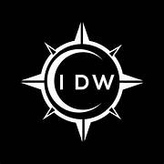

# IDW S.A. - Reserva de Salones para Eventos



Sitio web oficial de IDW S.A., especialistas en alquiler de salones para eventos sociales y corporativos, con especial atención a fiestas infantiles.

## Características del Proyecto

- 🏛️  Página de inicio con catálogo de salones disponibles
- 🏢  Sección institucional con información de la empresa
- 📞  Página de contacto con formulario interactivo
- 💻  Diseño responsive (adaptable a móviles y tablets)
- 🎨  Estilos modernos y atractivos

## Integrantes del Equipo

- Andrea Romero
- Emanuel Conte
- Nahuel Marcilli
- Veronica Peluffo
- Maria Belen Colado

## Estructura del Sitio
```text
/idw-sa/
├── css/ # Archivos de estilos
│  └── styles.css # Hoja de estilos principal
├── js/ # Archivos de javcascript
│  └── app.js
│  └── data.js
├── images/ # Imágenes del sitio
├── index.html # Página principal
├── institucional.html # Información corporativa
├── contacto.html # Formulario de contacto
└── README.md # Este archivo
```

## Tecnologías Utilizadas

- HTML5 semántico
- CSS3 moderno (Flexbox, Grid)
- Diseño mobile-first
- Iconos y elementos visuales optimizados

## Cómo Contribuir

1. Clona el repositorio:
   ```bash
   git clone https://github.com/tu-usuario/idw-sa.git

2. Abre el proyecto en tu editor de código favorito

3. Realiza tus cambios o mejoras

4. Haz commit de tus cambios:
   git commit -m "Descripción de los cambios"

5. Sube tus cambios al repositorio:
   git push origin main

## Requisitos para TP1
<pre> ✅ Estructura HTML básica
 ✅ Conexión a CSS
 ✅ Páginas mínimas requeridas (Inicio, Institucional, Contacto)
 ✅ Estilo establecido para la estructura web
 ✅ Lista de integrantes</pre>

## Próximas Mejoras (TP2)
- Implementación de Bootstrap

- Mejora de la barra de navegación

- Carrusel de imágenes

- Formularios más interactivos

- Optimización para SEO

## Licencia
Este proyecto está bajo la licencia MIT. Ver el archivo LICENSE para más detalles.

© 2025 IDW S.A. - Todos los derechos reservados

